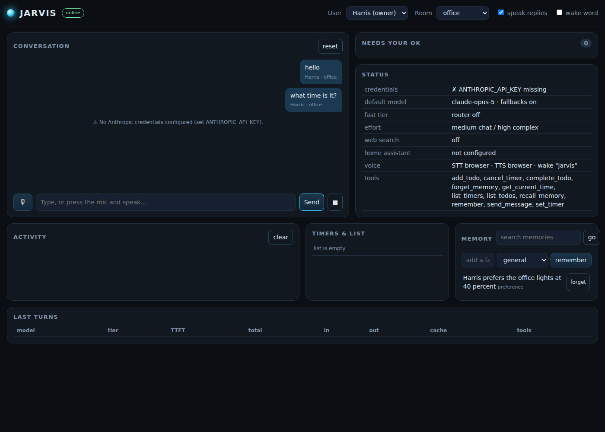

# Jarvis

A self-hosted, voice-first personal AI assistant with a live dashboard — the software half of the plan in
[`docs/JARVIS-PLAN.md`](docs/JARVIS-PLAN.md). Runs on a laptop today; designed to grow into the room-satellite,
local-speech, Home-Assistant-hub architecture the plan describes.

- **Plan and research:** [`docs/JARVIS-PLAN.md`](docs/JARVIS-PLAN.md) · [`docs/research/`](docs/research/)
- **Code:** `jarvis/` (Python 3.11+, FastAPI, Anthropic SDK) · **Dashboard:** `jarvis/server/static/`
- **Tests:** `pytest -q` (28 tests, no API key required)



## What works in v0.1

| Area | Status |
|---|---|
| Brain | Claude (default `claude-opus-5`) via the Anthropic SDK: streaming, adaptive thinking, prompt caching, effort control, optional server-side refusal fallbacks, optional web search tool, tiered router (`claude-sonnet-5` fast tier, opt-in) |
| Voice | Sentence-level streaming to speech; browser STT/TTS out of the box (Web Speech API), wake word ("Jarvis") and barge-in in the dashboard; server adapters for faster-whisper and Kokoro behind the same interface |
| Tools | Time, memory (remember/recall/forget), timers, to-do list, messaging (Telegram or dashboard), Home Assistant (list entities, get states, call services with post-action verification) |
| Safety | Permission engine (allow / ask / deny per tool, per input, per role: guest < child < adult < owner), spoken or dashboard confirmations, audit log of every tool call, untrusted-content rules in the system prompt, memory quarantine flag |
| Memory | SQLite episodic log + FTS5 fact store; per-turn recall injected into context |
| Dashboard | Live transcript with streaming text, mic + wake word, approvals inbox, tool activity log, timers/list, memory browser, per-turn latency and token metrics, status (models, HA, voice) |
| Ops | `.env` config, Docker/Compose, optional dashboard token, CLI (`jarvis serve|chat|policy`) |

Not yet: room satellites, local GPU speech models wired in (adapters exist), MCP servers, mem0/Graphiti, cameras, proactive announcements. Those are Phases 3–5 of the plan.

## Quick start

```bash
git clone https://github.com/harrisFM/Jarvis && cd Jarvis
python3 -m venv .venv && source .venv/bin/activate
pip install -e ".[dev]"
cp .env.example .env            # set ANTHROPIC_API_KEY (and HA_URL/HA_TOKEN if you have Home Assistant)
jarvis serve                    # http://localhost:8080  (use Chrome for the mic and voice)
```

Terminal only: `jarvis chat --user owner --room kitchen`. Print the permission table: `jarvis policy`.

Docker: `docker compose -f infra/docker-compose.yml up -d --build`.

Try in the dashboard: *"set a tea timer for three minutes"*, *"remember that Alex likes oat milk"*, *"what do you know about Alex?"*,
*"turn on the kitchen light"* (with Home Assistant), *"tell Alex dinner is at seven"* (this one stops in **Needs your OK** until you approve by button or by saying "yes").

## How it fits together

```
dashboard / CLI ──WebSocket/REST──▶ FastAPI (jarvis/server) ──▶ Agent loop (jarvis/brain/agent.py)
                                                                  │  route → stream Claude → chunk sentences → "speak" events
                                                                  ├─ Permission engine (jarvis/policy) → allow / ask (wait for human) / deny
                                                                  ├─ Tools (jarvis/tools): time, memory, timers, todos, messaging, Home Assistant
                                                                  ├─ Memory (jarvis/memory): episodes + facts (SQLite/FTS5)
                                                                  └─ Audit log (jarvis/policy/audit.py)
```

Every stage exchanges text plus metadata (room, speaker, timestamps) over an in-process event bus, so any component can be
swapped, logged, evaluated and guarded — the design principle from the plan.

## Configuration

See [`.env.example`](.env.example). Key switches: `JARVIS_MODEL_DEFAULT`, `JARVIS_ROUTER_ENABLED` (cheaper fast tier for
short device commands), `JARVIS_EFFORT_CHAT`, `JARVIS_WEB_SEARCH`, `HA_URL`/`HA_TOKEN`/`HA_EXPOSED_ENTITIES`,
`JARVIS_USERS` (household members and roles), `JARVIS_STT`/`JARVIS_TTS` (`browser` or local models),
`JARVIS_DASHBOARD_TOKEN` (required when exposing the dashboard beyond localhost; use it behind Tailscale).

## Repository layout

```
docs/            plan and research notes
jarvis/brain     agent loop, router, prompts, sentence chunker
jarvis/tools     tool registry, built-in tools, Home Assistant client
jarvis/policy    permission rules, approvals, audit log
jarvis/memory    SQLite episodic + fact store
jarvis/voice     STT/TTS adapters (browser, faster-whisper, Kokoro)
jarvis/server    FastAPI app, WebSocket, dashboard (static HTML/JS/CSS)
agent/prompts    persona notes appended to the system prompt
agent/policies   household permission policy in prose
infra/           Dockerfile, docker-compose
tests/           pytest suite with a scripted fake model client
```
